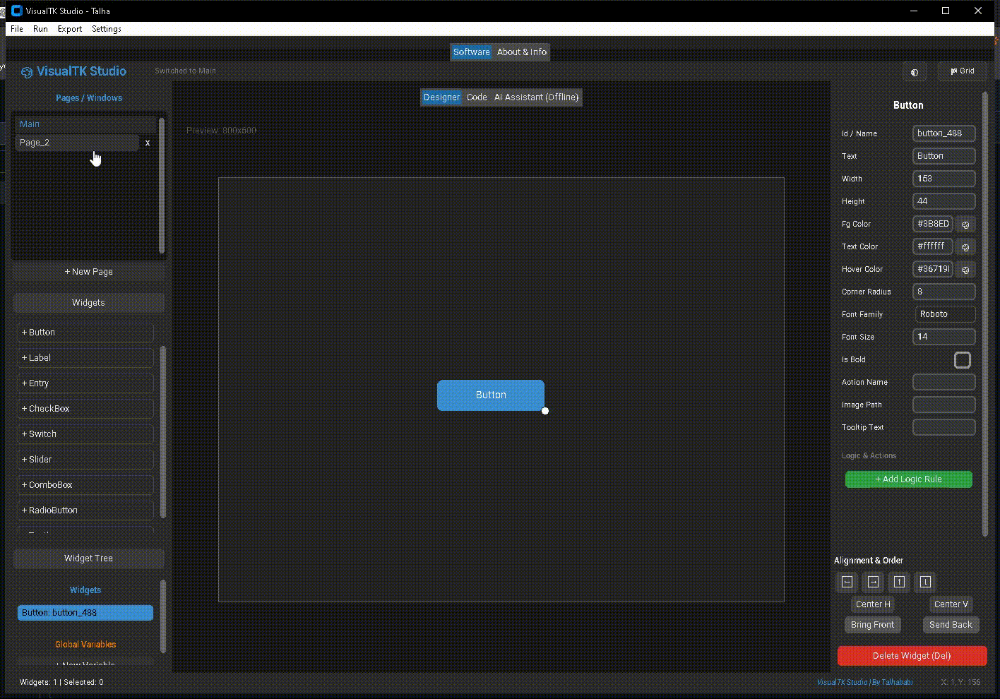
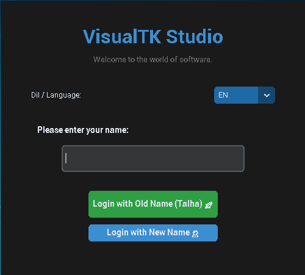
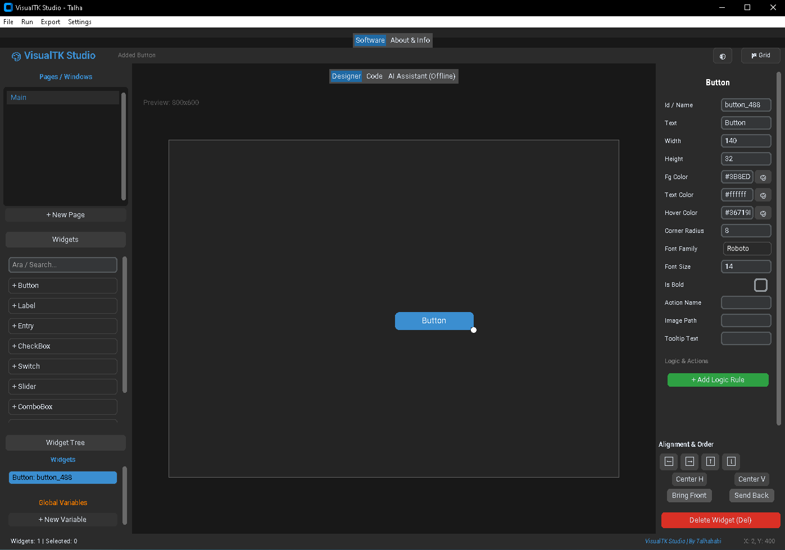
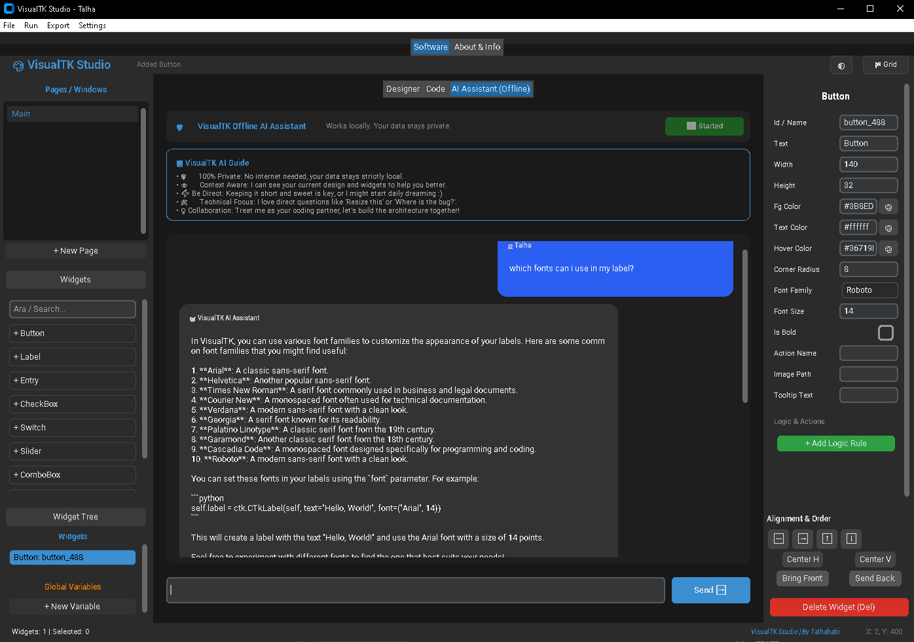
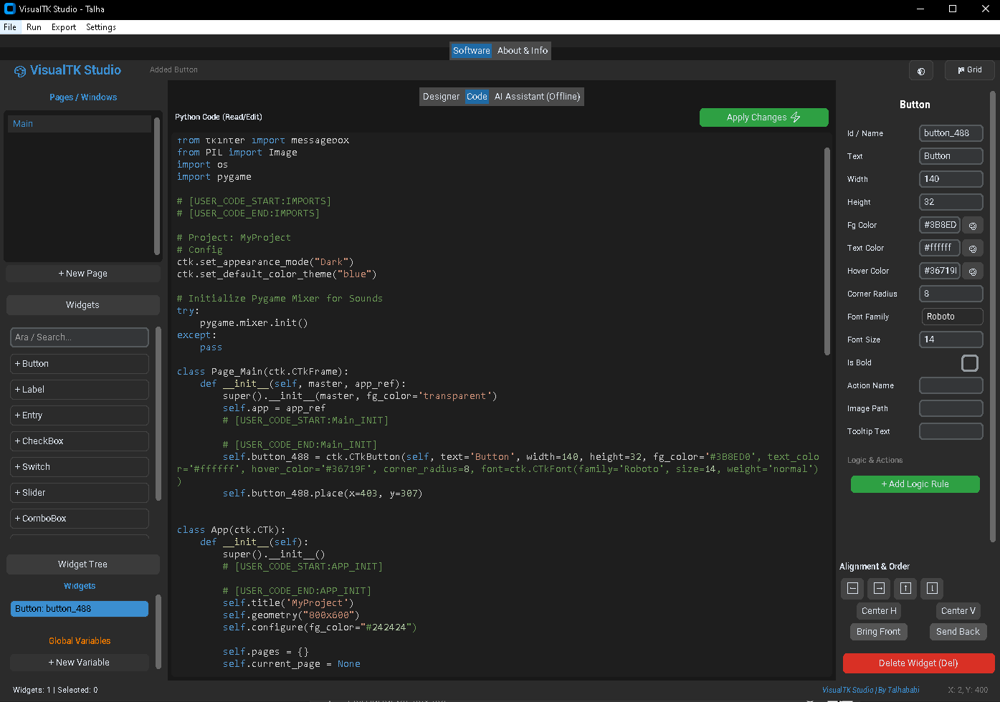
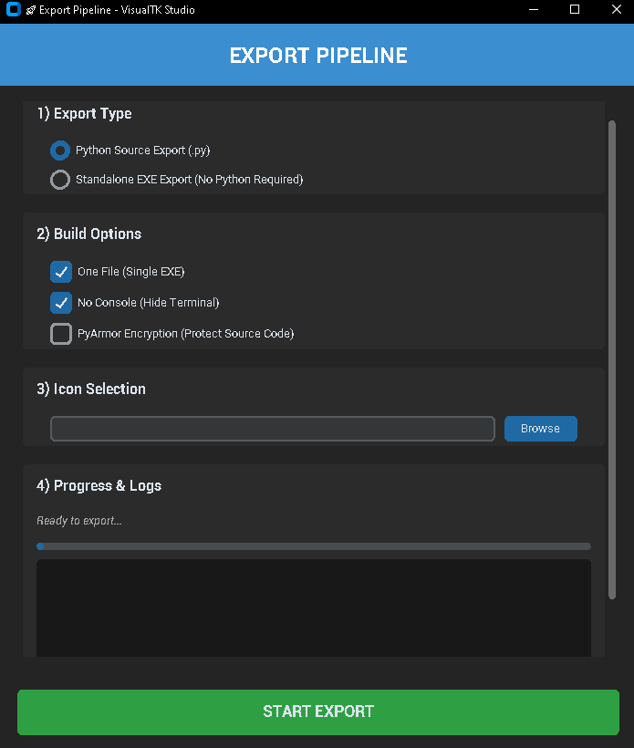
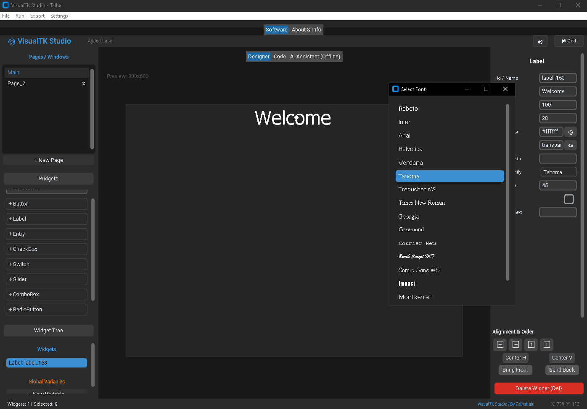

  

  

# VisualTK-Studio
Drag &amp; Drop CustomTkinter GUI Builder with Logic Rules, Variables, Multi-Page Support and Export Pipeline. Demo version available.
# ⚡ VisualTK Studio

VisualTK Studio is a drag & drop GUI builder for CustomTkinter.

Build desktop applications visually without writing large amounts of code.

---

## ✨ Core Features

- Drag & Drop Widget Designer
- Multi-Page System
- Advanced Property Editor
- Logic Rules System (IF / ELSE support)
- Global Variables System
- JSON Project Save / Load
- Built-in Code Editor with Syntax Highlighting
- Menu Bar Interface
- Template System
- Autosave Support

---

## 🧠 Logic Rules System

Add logic rules to widgets:

- IF / ELSE conditions
- Update widgets dynamically
- Update variables
- Show messages
- Switch pages
- Play sound
- File operations (create, write, append, delete)
- Append text
- Math calculations

No complex coding required.

---

## 📦 Export System

Demo version includes:

- Python export

Full version includes:

- Standalone EXE export
- No Python required export
- Full export pipeline
- AI Assistant
- Advanced export settings

---

## 🖼 Screenshots

### Login Screen

### Main Screen

### AI Assistant

### Code Editor

### Export Pipeline

### Logic Rules

### Font Picker

---

## 🎯 Who Is This For?

- Developers learning CustomTkinter
- Rapid application builders
- Prototype creators
- Indie developers

---

## 🚀 Demo Version

This repository contains the **Demo Version**.

Limitations:

- Advanced export options disabled
- AI Assistant disabled
- Some premium features restricted

Demo allows full testing of the core builder system.

---

## 💰 Full Version

Full version includes:

- Standalone EXE export
- No Python required export
- AI Assistant
- Full export pipeline
- Lifetime updates (one-time payment)

Available on Gumroad:

will be edited

---

## 📥 Download

Download the Demo EXE from the Releases section.

---

## 🛠 Requirements (Source Version)

Python 3.10+

Modules:
- customtkinter
- pillow
- requests

---

## ⚠ License

This project is source-available.

Redistribution, modification and commercial use are not allowed without permission.

See LICENSE.md for details.
